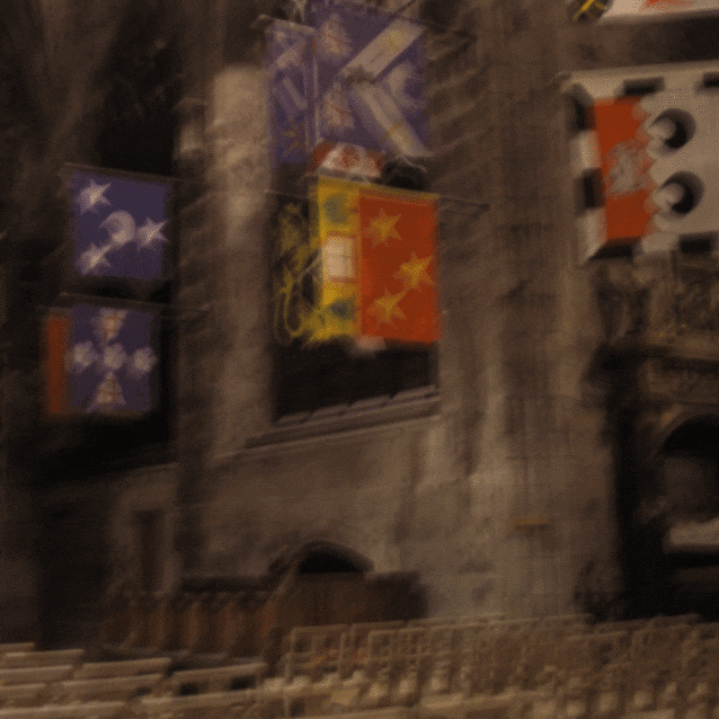
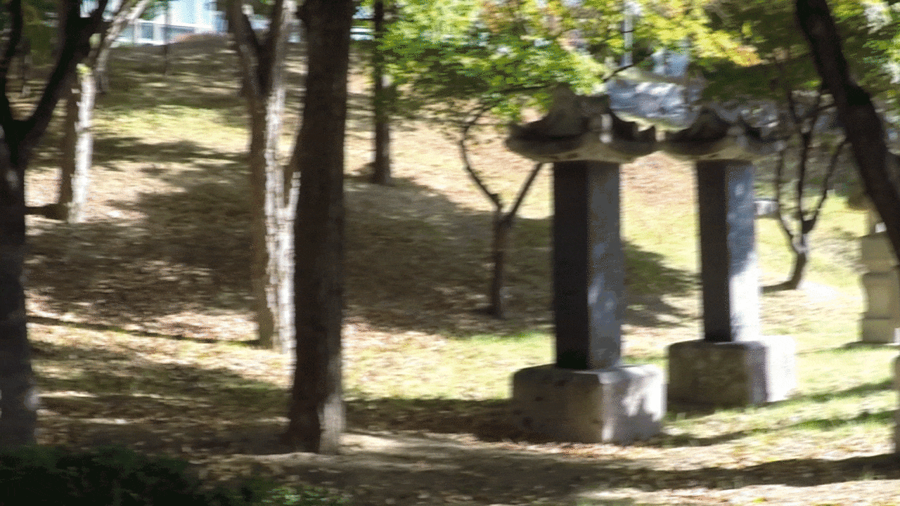

# Kernel_raznos
### Skoltech ML course project, "tema_raznosa"

This is the page of our course project that is part of Skoltech's Machine Learning course. 
The main task is implement and benchmark different algorithms for "Image restoration" task i.e. deblurring.
In this repository you can check the results of our study.

### General project goals:

In this paper, the authors propose the model of non-uniform motion blur, which
generalize the  common used uniform model of blurring process. The key idea is to use not one kernel for the whole image, but per-pixel blur kernels. Our team is supposed to code and reproduce the results of the authors for Kohler and Gopro datasets with real blur and compare them with DeblurGAN model.

To check our task click [here](https://docs.google.com/spreadsheets/d/1yvhUzqHK9bmbD7OdSE-DOcadRlaeC3xECUwOMFZgw-Q/edit#gid=0)

## Dataset

### Description
1. ***The Kohler dataset*** evaluates motion deblurring algorithms using a sequence of sharp images sampled from a six-dimensional camera motion trajectory. It incorporates a non-uniform blur model to simulate real camera motion and can be used to benchmark state-of-the-art algorithms using metrics like PSNR and SSIM.
2. ***The GoPro dataset*** is a collection of 33 blurry videos captured by a moving camera, alongside corresponding sharp videos, that serves as a benchmark for video deblurring. It contains additional information such as camera parameters, motion metadata, and evaluation metrics to aid the comparison and evaluation of video deblurring algorithms.  

### Download 

* Kohler dataset [Download](https://webdav.tuebingen.mpg.de/pixel/benchmark4camerashake/#Image1_1)
* GoPro dataset [Download](https://seungjunnah.github.io/Datasets/gopro.html)

## Materials

### References: 
1. Non-uniform Blur Kernel Estimation via Adaptive Basis Decomposition [arXiv Paper Version](https://arxiv.org/pdf/2102.01026.pdf)
2. DeblurGAN: Blind Motion Deblurring Using Conditional Adversarial Networks [arXiv Paper Version](https://arxiv.org/pdf/1711.07064.pdf)

### Project content: 
1. Our team's final presentation [open](Docs/ML2023_project18.pdf)
2. Scientific style final report [open](Docs/Final_report.pdf)
3. **DeblurGAN Model trained from scratch by our team** [check here](DeblurGAN/Model_trained/)

## Github structure 
1. **Adaptive_basis_decomposition**: deblurred images for Kohler dataset, with different gamma_correction parameter, and .ipynb file with code for calculation of losses
2. **DeblurGAN**:  deblurred images for Kohler and GoPro datasets. Model_trained contains weights of our trained model.
3. **Docs**:  final report, reference papers, team presentation and all misc files used in Readme.md (file attached in links)
4. **Metrics**: .txt format files with PSNR/SSIM metrics for corresponding datasets.
5. **Dataset_generation_script** contains our code to generate syntetic blur
# Our results
<p align="center">
  
  <br>
  <strong>Original Blurry Image</strong>
</p>

<p align="center">
  
  <br>
  <strong>Deblurred Image using Deep Generative Adversarial Network (DeblurGAN)</strong>
</p>

<p align="center">
  
  <br>
  <strong>Deblurred Image using Adaptive Basis Estimation </strong>
</p>


<div align="center">
  
  |                   | Blurry   | Hirsch   | DeblurGAN | Adaptive  |
  | :---       | :--- | :--- | :--- | :--- | 
  | **PSNR Expected**     | 27.58 | 33.16 | NA    | 35.19 | 
  | **PSNR Calculated**   | 27.58 | 33.16 | 26.98 | 34.47 | 

</div>

## Our Metrics

<div align="center">
  


<br>
  
|                       |  Kohler   |   GoPro  | 
| :---                  | :--- | :---: | 
| Adaptive expected   | 28.39 (0.82) | NA | 
| Adaptive aquired   | 26.86 (0.80) | 31.21 (0.91) | 
| DeblurGAN aquired   | 25.97 (0.75) | 32.12 (0.98) | 

<strong> Mean PSNR (SSIM) values for three algorithms </strong>
  <br>
</div>
<br>
<div align="center">
  

  <br>
  
</div>

We were unable to fully reproduce the results of the scientific article.... our PSNR results were on average 1.5 Db lower than those stated in the authors' article. We tested all the photos of the Kohler dataset, and used a valid metric, using the matlab scripts provided in this dataset. Our assumption is that the results of the article could have been slightly overstated.

## DeblurGAN training 


<p align="center">
  
  <br>
  <strong> Our trained model </strong>
</p>

<br>


# Getting started localy

## Tips

1. make sure that you have sufficient GPU with at least >4 gb of video memory, our setup had Nvidia gtx 1660(laptop) 6GB. Our recomendation is to use PC descrete GPU with ~12GB of videomemory.
3. The installation procces of CUDA and initiolizing of setup can be a little bit challenging, look for the Nvidia official [guide](https://docs.nvidia.com/cuda/cuda-quick-start-guide/index.html) how to install CUDA.
4. We reccomend you to use conda enviroment to setup CUDA+PyTorch setup, you can use PyTorch's [guide](https://pytorch.org/get-started/locally/) to do so. 

## Requirements
* scikit-image
* numpy
* torch==1.4.0
* torchvision==0.5.0
* opencv-python
* CUDA toolkit 11.6

## Metric evaluation
Since the Kohler dataset is synthetic blurred with non uniform kernels, standart approaches to calculate PSNR does not show valid results, thus, we use MATLAB instruments to find PSNR and SSIM.
Here you can check instructions for benchmarking deblur algorithms on [Kohler dataset](https://webdav.tuebingen.mpg.de/pixel/benchmark4camerashake/#Image1_1)
## Non-uniform Blur Kernel Estimation via Adaptive Basis Decomposition


## Network Architecture

<p align="center">

  </p>
  
### Open official repository
* Go to this link, follow the official [guide](https://github.com/GuillermoCarbajal/NonUniformBlurKernelEstimationViaAdaptiveBasisDecomposition) of installation and testing nn. 


### Download the pretrained model

Model can be downloaded from here ([dropbox](https://www.dropbox.com/s/ro9smg1i7lh5b8d/TwoHeads.pkl?dl=0))

### Compute kernels from an image
```
python compute_kernels.py -i image_path -m model_path
```


### Deblur an image or a list of images
```
python image_deblurring.py -b blurry_img_path --reblur_model model_path --output_folder results
```

### Parameters
Set `--gamma_factor`: gamma correction factor. By default is assummed `gamma_factor=2.2`. For Kohler dataset images `gamma_factor=1.0`.
  
### NonUniform output example 


<p align="center">
   
  <br>
  <strong> Kohler input/output </strong>
  <br>
 </p>
# DeblurGAN
DeblurGAN is a neural network for motion deblurring using a conditional GAN and content loss for learning. It achieves state-of-the-art performance in both structural similarity measure and visual appearance. The method also introduces a approach to generating synthetic motion blurred images from sharp ones, allowing for realistic dataset augmentation. It has newer version "DeblurGANV2", but in this research we decided to used the first one since the repository and guide is more user friendly and easier to follow.

This network takes blurry image as an input and procude the corresponding sharp estimate, as in our case:


<p align="center">
  
  <br>
  <strong> DeblurGAN architecture </strong>
</p>

### Installation
* Official KupynOrest git reposetory [here](https://github.com/KupynOrest/DeblurGAN)
* Useful fork with good readme and instructions [here](https://github.com/fatalfeel/DeblurGAN)

### Train
- python3 ./train.py --dataroot ./data/combined --resize_or_crop crop --display_id -1 --cuda True --which_model_netG FPN101 --gan_type wgan-gp

### Test
- python3 ./test.py --dataroot ./data/blurred --model test --dataset_mode single --cuda True
- [----------FPN101----------]
- python3 ./test.py --dataroot ./data/blurred --model test --dataset_mode single --cuda True --which_model_netG FPN101

### DeblurGAN output example 


<p align="center">
   
  <br>
  <strong> GoPro input/output </strong>
  <br>
  <br>
  
  <br>
  <strong> Kohler input/output </strong>
</p>

